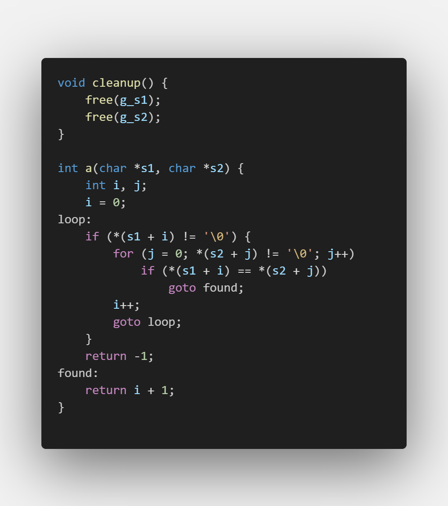
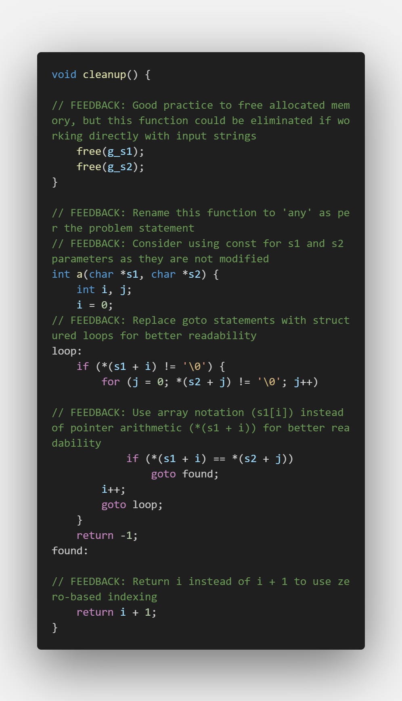
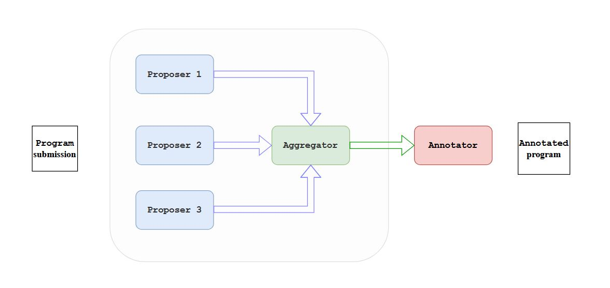

-----
CodeInsight is a tool that makes use of large language models (LLMs) to provide feedback on student submissions for programming assignments. Its feedback takes the form of annotations (code comments) inserted at appropriate points in the student program. 

Please note that this tool does not evaluate the correctness of implementation. That is usually done by carefully-designed test cases.




### Usage

After cloning the repository, please install the required packages using the following command:

```bash
pip install -r requirements.txt
```
You'll need API keys to make calls to LLMs on Anthropic, OpenAI and Together.ai services. For this, please set these keys as environment variables `$ANTHROPIC_API_KEY` `$OPENAI_API_KEY` and `$TOGETHER_API_KEY` respectively; CodeInsight will pick up these key values from the environment.

Finally, to run the tool, use the following command:

```bash
python3 assignment_evaluator.py <path_to_problem_statement_txt> <path_to_student_code_c> 
```
example:

```bash
python3 assignment_evaluator.py data/sort_arguments.txt data/sort_arguments.cc
```
To run over a batch of programs, please use `generate_annotations.py` script.

**Configuration** - You can set the number of proposers and types of LLMs by changing the `config.yaml` file. You can even add/delete the parameters of evaluations using this `yaml` file. To add a parameter, simply add the appropriate system prompt `.txt` file to `/prompts`.

### Parameters of Evaluation

CodeInsight provides qualitative feedback on the following parameters:

1. Reasonable efficiency

2. Cleanliness/readability

3. Language conventions

4. Program design

5. Data structures

6. Pointers/memory

To understand details about these parameters, please consults the respective prompts under the `/prompts` folder. 

Our implementation has been inspired by the evaluation rubrics given [here](https://web.stanford.edu/class/archive/cs/cs107/cs107.1166/advice_assigngrade.html).

### Technical Details

CodeInsight takes a [mixture-of-agents](https://arxiv.org/abs/2406.04692) approach. The system is divided into three main components:

1. **Proposers** - These LLMs identify issues with the student submission and summarize them. Since a single LLM may not be able to capture all the issues and its proposed issues may not always be correct, we use multiple LLMs to propose issues. Proposers send LLM request for each parameter separately.

    In our implementation, we use 4 proposers: `Claude-3.5-Sonnet`, `GPT-4o`, `Mixtral-8x22B`, and `Llama-3.1-405B`.

2. **Aggregator** - This component takes in the proposed feedback of all the proposers and decides which issues to include in the final feedback. We make call to Aggregator for each parameter separately.

    In our implementation, we use Claude-3.5-Sonnet as the aggregator.

3. **Annotator** - This component takes the final feedback from the aggregator and inserts it into the student's code. The annotator is responsible for inserting the feedback at the appropriate locations in the student's code. This is done for all the parameters together in one shot.

    In our implementation, we use `Claude-3.5-Sonnet` as the annotator.



In addition, we have a final component:

**Comparator** - It makes a call to `Claude-3.5-Sonnet` to compare the quality of two different feedback outputs. This is used to compare the quality of feedback generated by CodeInsight with the feedback generated by a good human programmer.

### Comparison with Human Feedback

We compare the quality of feedback generated by CodeInsight with the feedback generated by two competent human programmers over a set of 10 C programs (these can be found in `/data/testing/`).

We found that CodeInsight does equally well as the competent human programmers with an average win-rate of 5-5 over the 10 programs.

### Acknowledgements

I would like to thank Aman Paliwal and Arbaaz Shafiq, undergraduate students at Plaksha University, for providing diligent feedback on the test C programs for comparison of performance.

## License

This project is licensed under the MIT License - see the [LICENSE](LICENSE) file for details.
